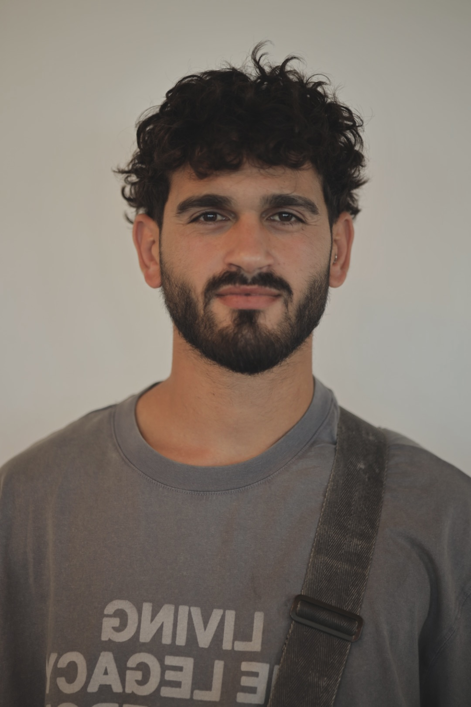

# Hi 👋, I'm Ori Yair Yaakov  

🎓 B.Sc. Computer Science @ Ariel University (Final Year)  
💻 Full-Stack & Backend Developer | Military Service & IMPACT Scholarship Program  
🌱 Exploring AI, Machine Learning & System Design  
📫 Reach me: [LinkedIn](https://www.linkedin.com/in/ori-yair-yaakov/) | [Email](mailto:yair852258@gmail.com)  

---

### 🧑‍💻 About Me
- 👨‍🎓 GPA: 91, Dean’s List, Ariel University  
- 💡 Experience in **Java, Python, C, C++, JavaScript, SQL**  
- ⚡ Projects: Flower Image Classification (ML), QUIC-like Protocol, Catan Simulation, Room Management System  
- 🎯 Interested in **Backend Development, AI, and Scalable Systems**

---

### 🚀 Languages and Tools

  
  
  
  
  
  
  

---

### 📊 GitHub Stats
  

---

### 📸 Personal

  

