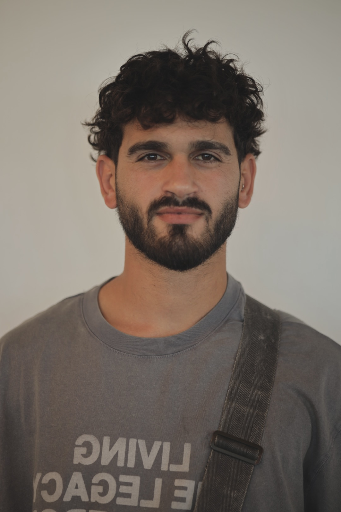

# Ori Yair Yaakov  
### Backend Development • RAG • Networking
   
- Full-Stack & Backend Developer   
- B.Sc. Computer Science 
- How to reach me [LinkedIn](https://www.linkedin.com/in/yairyaakov/) | [Email](mailto:yair852258@gmail.com) 

  

---

### 🧑‍💻 About Me
- GPA: 91, Dean’s List, Ariel University  
- Experience in **Java, Python, C, C++, JavaScript, SQL**  
- Projects: Retrieval Augmented Generation (RAG) Service, AI Crypto Advizor, QUIC  

---

### 🚀 Languages and Tools

  
  
  
  
  
  
  

---

